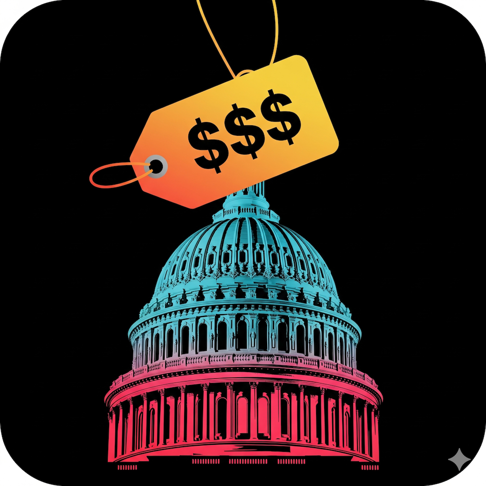
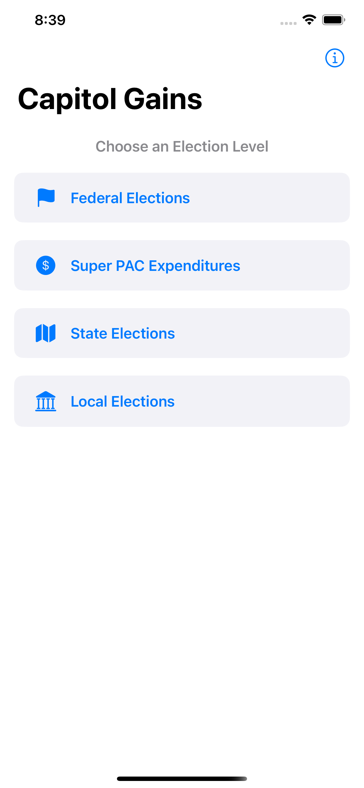
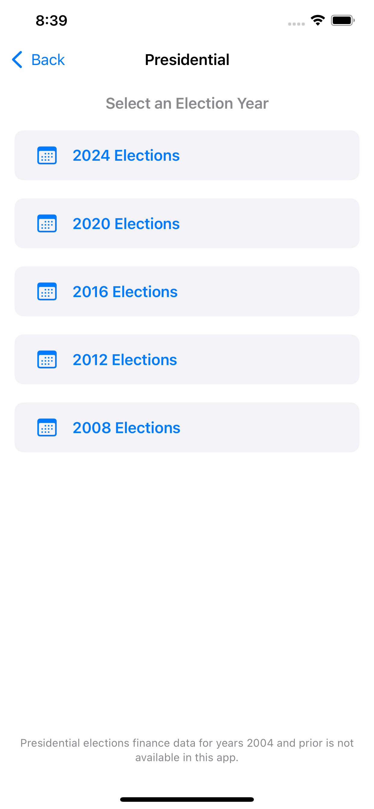
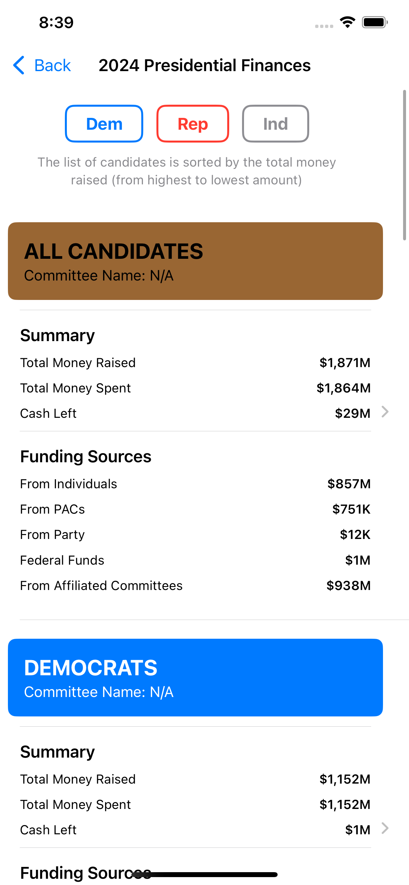
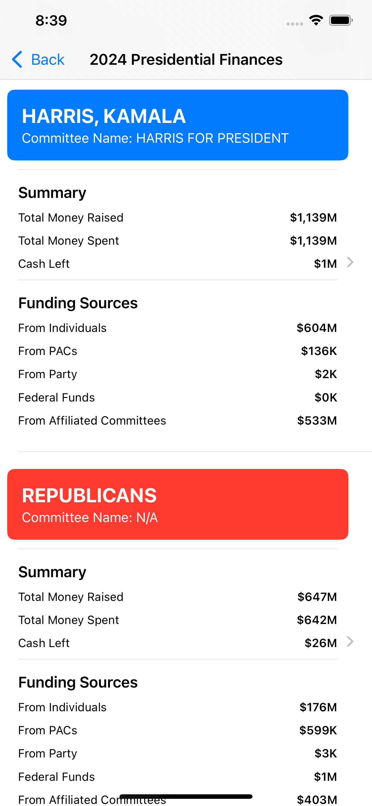
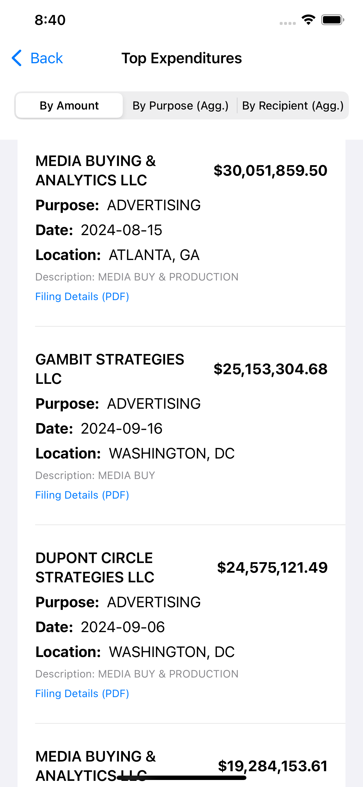
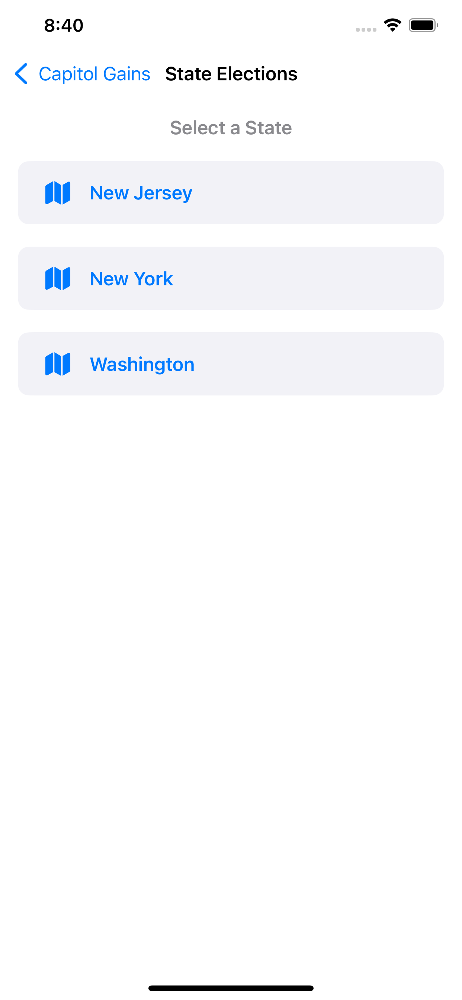
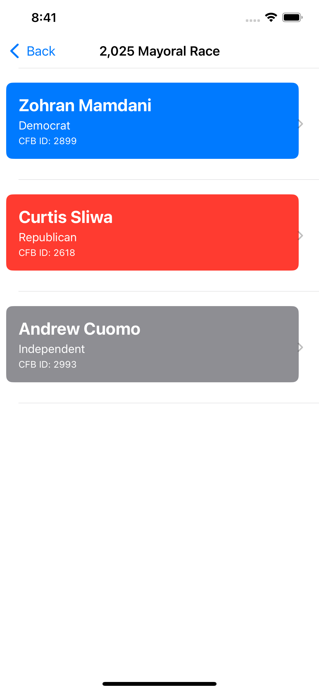
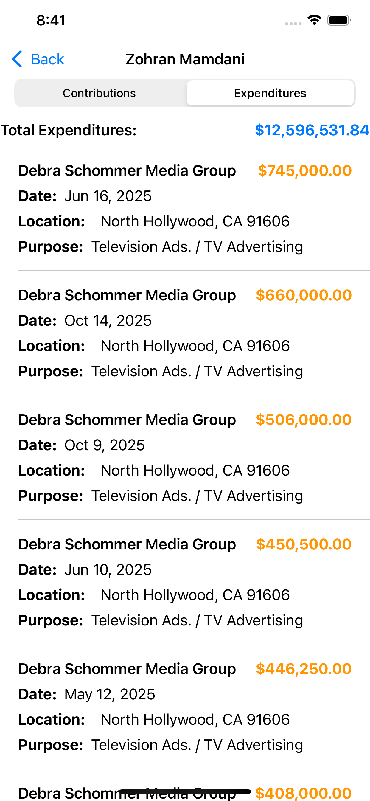

<p align="center">
  
  <h1 align="center">BallotBux</h1>
  
  <p align="center">
    <strong>Follow the money in US politics, from D.C. to your City Hall.  Download iOS app <a href="https://apps.apple.com/app/ballotbux/id6754804701">here.</strong>
  </p>
</p>

<p align="center">
  
  
  
</p>

---

## About The Project

BallotBux provides users with clear visibility into campaign finances for political elections in the United States. Follow the money and see who is funding candidates at the federal, state, and local levels. This app aggregates data from various public APIs to present a streamlined, mobile-friendly view of contributions and expenditures.

---

## Features

* **Federal Elections:** Track finances for Presidential, Senate, and House races.
* **State Elections:** Detailed contribution and expenditure data for state-level races in New York, New Jersey, Illinois, and Washington.
* **Local Elections:** Mayoral election finance tracking for major US cities, including New York City, Los Angeles, San Francisco and Austin.
* **Super PACs:** View top expenditures from Super PACs, filterable by candidate and election cycle.
* **Detailed Views:** Drill down into specific candidates to see itemized contributions, expenditures, and top donor/payee lists.

---

## Screenshots

<table>
  <tr>
    <td width="50%" align="center">
      <b>Campaign finances for federal, state and local elections!</b><br>
      
    </td>
    <td width="50%" align="center">
      <b>Across several past years!</b><br>
      
    </td>
  </tr>
  <tr>
    <td width="50%" align="center">
      <b>Drill down into finances of a specific election cycle!</b><br>
      
    </td>
    <td width="50%" align="center">
      <b>Or a specific candidate!</b><br>
      
    </td>
  </tr>
  <tr>
    <td width="50%" align="center">
      <b>Track how every single dollar was received or spent!</b><br>
      
    </td>
    <td width="50%" align="center">
      <b>See state and local election details!</b><br>
      
    </td>
  </tr>
  
  <tr>
    <td width="50%" align="center">
      <b>Track recent or upcoming election campaign's finances!</b><br>
      
    </td>
    <td width="50%" align="center">
      <b>And where is the money being spent!</b><br>
      
    </td>
  </tr>

</table>

---

## Tech Stack

* [SwiftUI](https://developer.apple.com/xcode/swiftui/)
* [URLSession](https://developer.apple.com/documentation/foundation/urlsession) (for all networking)
* [Socrata (SoQL)](https://dev.socrata.com/) (for SF & NY OpenData APIs)

---

## Getting Started

To get a local copy up and running, follow these simple steps.

### Prerequisites

* Xcode 16.0 or later
* An Apple Developer Account (for on-device testing)
* A San Francisco OpenData App Token

### Installation

1.  Clone the repo
    ```sh
    git clone [https://github.com/your_username/BallotBux.git](https://github.com/your_username/BallotBux.git)
    ```
2.  Create the `Secrets.xcconfig` File
    * At the root of the project (in the same directory as `BallotBux.xcodeproj`), create a new file named `Secrets.xcconfig`.
3.  Add Your API Token
    * Add your San Francisco OpenData app token to the new file:
    ```ini
    SF_APP_TOKEN = "YOUR_SF_APPDATA_TOKEN_GOES_HERE"
    ```
4.  Add `Secrets.xcconfig` to `.gitignore`
    * To protect your token, ensure `Secrets.xcconfig` is listed in your `.gitignore` file.
5.  Link `Secrets.xcconfig` in Xcode
    * Drag the `Secrets.xcconfig` file into the Xcode Project Navigator (at the root level). When prompted, **uncheck** all targets.
    * Click the **Project** (blue icon) > **Info** tab > **Configurations** section. Set both **Debug** and **Release** to use **"Secrets"**.
6.  Add Token to Target Info
    * Click the **Target** (app icon) > **Info** tab.
    * Click the **"+"** button to add a new row under "Custom Target Properties".
    * **Key:** `SF_APP_TOKEN`
    * **Value:** `$(SF_APP_TOKEN)`
7.  Open `BallotBux.xcodeproj` in Xcode and run the app.

---

## Acknowledgements

This app relies on publicly available data from the following sources:

* [FEC.gov](https://api.open.fec.gov/): Federal Election Commission API for all federal election data.
* [NY OpenData](https://data.ny.gov/): New York State campaign finance data.
* [NJ ELEC](https://www.njelecefilesearch.com/): New Jersey Election Law Enforcement Commission search portal.
* [WA OpenData](https://data.wa.gov/): Washington State Public Disclosure Commission data.
* [Illinois State Board of Elections](https://www.elections.il.gov/): Illinois campaign disclosure data files.
* [NYC Campaign Finance Board](https://www.nyccfb.info/): New York City campaign finance data.
* [San Francisco OpenData](https://data.sfgov.org/): San Francisco Ethics Commission data.
* [Log Angeles Open Data](https://https://data.lacity.org): Los Angeles campaign finance data.
* [Austin Open Data](https://data.austintexas.gov/): Austin campaign finance data. 

---

## License

Distributed under the MIT License. See `LICENSE` file for more information.
